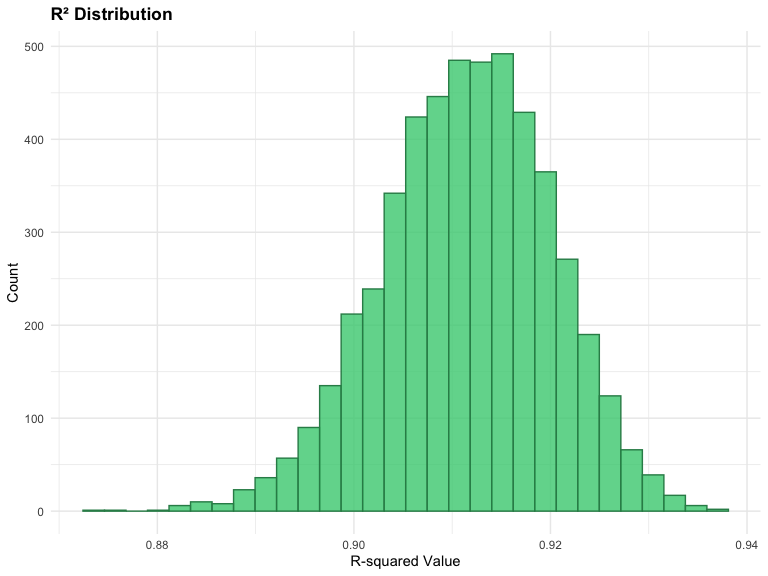
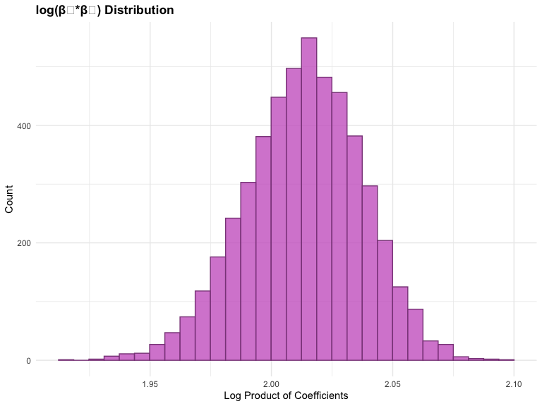

p8105_hw6_yg2964
================
2024-12-02

``` r
library(tidyverse)
```

    ## ── Attaching core tidyverse packages ──────────────────────── tidyverse 2.0.0 ──
    ## ✔ dplyr     1.1.4     ✔ readr     2.1.5
    ## ✔ forcats   1.0.0     ✔ stringr   1.5.1
    ## ✔ ggplot2   3.5.1     ✔ tibble    3.2.1
    ## ✔ lubridate 1.9.3     ✔ tidyr     1.3.1
    ## ✔ purrr     1.0.2     
    ## ── Conflicts ────────────────────────────────────────── tidyverse_conflicts() ──
    ## ✖ dplyr::filter() masks stats::filter()
    ## ✖ dplyr::lag()    masks stats::lag()
    ## ℹ Use the conflicted package (<http://conflicted.r-lib.org/>) to force all conflicts to become errors

``` r
library(modelr)
library(ggplot2)
library(mgcv)
```

    ## Loading required package: nlme
    ## 
    ## Attaching package: 'nlme'
    ## 
    ## The following object is masked from 'package:dplyr':
    ## 
    ##     collapse
    ## 
    ## This is mgcv 1.9-1. For overview type 'help("mgcv-package")'.

``` r
library(broom)
```

    ## 
    ## Attaching package: 'broom'
    ## 
    ## The following object is masked from 'package:modelr':
    ## 
    ##     bootstrap

``` r
library(p8105.datasets)

knitr::opts_chunk$set(
    echo = TRUE,
    warning = FALSE,
    message = FALSE,
    fig.width = 8, 
  fig.height = 6,
  out.width = "90%"
)

theme_set(theme_minimal() + theme(legend.position = "bottom"))

options(
  ggplot2.continuous.colour = "viridis",
  ggplot2.continuous.fill = "viridis"
)

scale_colour_discrete = scale_colour_viridis_d
scale_fill_discrete = scale_fill_viridis_d

set.seed(924)
```

### Problem 1

``` r
weather_df = 
  rnoaa::meteo_pull_monitors(
    c("USW00094728"),
    var = c("PRCP", "TMIN", "TMAX"), 
    date_min = "2017-01-01",
    date_max = "2017-12-31") |> 
  mutate(
    name = recode(id, USW00094728 = "CentralPark_NY"),
    tmin = tmin / 10,
    tmax = tmax / 10) |> 
  select(name, id, everything())

get_resample = function(df) {
  sample_frac(df, replace = TRUE)
}

extract_metrics = function(model) {
  intercept = tidy(model) |> filter(term == "(Intercept)") |> pull(estimate)
  slope = tidy(model) |> filter(term == "tmin") |> pull(estimate)
  
  tibble(
    rsquared = glance(model)$r.squared,
    coef_product = log(abs(intercept * slope))
  )
}

resampling_sets = 
  tibble(rep = 1:5000) |>
  mutate(
    resamples = map(rep, ~get_resample(weather_df))
  )

resample_results = 
  resampling_sets |>
  mutate(
    fits = map(resamples, ~lm(tmax ~ tmin, data = .)),
    metrics = map(fits, extract_metrics)
  ) |>
  select(-resamples, -fits) |>
  unnest(metrics)

# Get confidence bounds
conf_intervals = resample_results |>
  summarize(across(everything(), 
                  list(lower = ~quantile(., 0.025),
                       upper = ~quantile(., 0.975))))

# Create visualizations
viz1 = resample_results |>
  ggplot(aes(x = rsquared)) +
  geom_histogram(fill = "seagreen3", color = "seagreen4", alpha = 0.8) +
  labs(title = "R² Distribution", 
       x = "R-squared Value", 
       y = "Count") +
  theme_minimal() +
  theme(plot.title = element_text(face = "bold"))

viz2 = resample_results |>
  ggplot(aes(x = coef_product)) +
  geom_histogram(fill = "orchid3", color = "orchid4", alpha = 0.8) +
  labs(title = "log(β₀*β₁) Distribution", 
       x = "Log Product of Coefficients", 
       y = "Count") +
  theme_minimal() +
  theme(plot.title = element_text(face = "bold"))

viz1
```



``` r
viz2
```



R² Distribution: Centered around 0.91 with values ranging from 0.88 to
0.94, showing a compact and symmetric distribution that indicates a
strong and stable linear relationship between tmax and tmin. log(β₀\*β₁)
Distribution: Centered around 2.02 with values ranging from 1.95 to
2.10, displaying a symmetric distribution that confirms stable, positive
coefficient products and supports the positive correlation between
variables.

### Problem 2

``` r
crime_data = read_csv("https://raw.githubusercontent.com/washingtonpost/data-homicides/master/homicide-data.csv") |>
  janitor::clean_names() |>
  mutate(
    location = paste(city, state, sep = ", "),
    case_solved = ifelse(disposition == "Closed by arrest", 1, 0),
    age = as.numeric(victim_age)
  ) |>
  filter(!location %in% c("Dallas, TX", "Phoenix, AZ", "Kansas City, MO", "Tulsa, AL")) |>
  filter(victim_race %in% c("White", "Black"))
```

#### Single City Analysis (Baltimore)

``` r
baltimore_data = crime_data |>
  filter(location == "Baltimore, MD") |>
  select(uid, case_solved, age, victim_sex, victim_race)

# Fit logistic model for Baltimore
fit_md_logistic = baltimore_data |>
  glm(case_solved ~ age + victim_sex + victim_race,
      data = _, family = binomial())

# Get Baltimore results
fit_md_logistic |>
  broom::tidy(conf.int = TRUE) |>
  mutate(
    OR = exp(estimate),
    OR_conf.low = exp(conf.low),
    OR_conf.high = exp(conf.high)
  ) |>
  filter(term == "victim_sexMale") |>
  select(term, OR, OR_conf.low, OR_conf.high) |>
  knitr::kable(digits = 3)
```

| term           |    OR | OR_conf.low | OR_conf.high |
|:---------------|------:|------------:|-------------:|
| victim_sexMale | 0.426 |       0.324 |        0.558 |

The odds of solving a homicide in Baltimore for male victims are 0.426
times the odds for female victims (95% CI: 0.324-0.558), after adjusting
for age and race. This indicates significantly lower clearance rates for
male victims compared to female victims.

#### Analysis for All Cities

``` r
# Function for City Analysis 
fit_logistic = function(data){
  model = glm(case_solved ~ age + victim_sex + victim_race,
              data = data, family = binomial())
  
  model |>
    broom::tidy(conf.int = TRUE) |>
    mutate(
      OR = exp(estimate),
      OR_conf.low = exp(conf.low),
      OR_conf.high = exp(conf.high)
    ) |>
    filter(term == "victim_sexMale") |>
    select(term, OR, OR_conf.low, OR_conf.high)
}
city_results = crime_data |>
  group_by(location) |>
  nest() |>
  mutate(
    model = map(data, fit_logistic)
  ) |>
  unnest(model) |>
  select(location, OR, OR_conf.low, OR_conf.high) |>
  ungroup()


city_results |>
  knitr::kable(digits = 3)
```

| location           |    OR | OR_conf.low | OR_conf.high |
|:-------------------|------:|------------:|-------------:|
| Albuquerque, NM    | 1.767 |       0.825 |        3.762 |
| Atlanta, GA        | 1.000 |       0.680 |        1.458 |
| Baltimore, MD      | 0.426 |       0.324 |        0.558 |
| Baton Rouge, LA    | 0.381 |       0.204 |        0.684 |
| Birmingham, AL     | 0.870 |       0.571 |        1.314 |
| Boston, MA         | 0.674 |       0.353 |        1.277 |
| Buffalo, NY        | 0.521 |       0.288 |        0.936 |
| Charlotte, NC      | 0.884 |       0.551 |        1.391 |
| Chicago, IL        | 0.410 |       0.336 |        0.501 |
| Cincinnati, OH     | 0.400 |       0.231 |        0.667 |
| Columbus, OH       | 0.532 |       0.377 |        0.748 |
| Denver, CO         | 0.479 |       0.233 |        0.962 |
| Detroit, MI        | 0.582 |       0.462 |        0.734 |
| Durham, NC         | 0.812 |       0.382 |        1.658 |
| Fort Worth, TX     | 0.669 |       0.394 |        1.121 |
| Fresno, CA         | 1.335 |       0.567 |        3.048 |
| Houston, TX        | 0.711 |       0.557 |        0.906 |
| Indianapolis, IN   | 0.919 |       0.678 |        1.241 |
| Jacksonville, FL   | 0.720 |       0.536 |        0.965 |
| Las Vegas, NV      | 0.837 |       0.606 |        1.151 |
| Long Beach, CA     | 0.410 |       0.143 |        1.024 |
| Los Angeles, CA    | 0.662 |       0.457 |        0.954 |
| Louisville, KY     | 0.491 |       0.301 |        0.784 |
| Memphis, TN        | 0.723 |       0.526 |        0.984 |
| Miami, FL          | 0.515 |       0.304 |        0.873 |
| Milwaukee, wI      | 0.727 |       0.495 |        1.054 |
| Minneapolis, MN    | 0.947 |       0.476 |        1.881 |
| Nashville, TN      | 1.034 |       0.681 |        1.556 |
| New Orleans, LA    | 0.585 |       0.422 |        0.812 |
| New York, NY       | 0.262 |       0.133 |        0.485 |
| Oakland, CA        | 0.563 |       0.364 |        0.867 |
| Oklahoma City, OK  | 0.974 |       0.623 |        1.520 |
| Omaha, NE          | 0.382 |       0.199 |        0.711 |
| Philadelphia, PA   | 0.496 |       0.376 |        0.650 |
| Pittsburgh, PA     | 0.431 |       0.263 |        0.696 |
| Richmond, VA       | 1.006 |       0.483 |        1.994 |
| San Antonio, TX    | 0.705 |       0.393 |        1.238 |
| Sacramento, CA     | 0.669 |       0.326 |        1.314 |
| Savannah, GA       | 0.867 |       0.419 |        1.780 |
| San Bernardino, CA | 0.500 |       0.166 |        1.462 |
| San Diego, CA      | 0.413 |       0.191 |        0.830 |
| San Francisco, CA  | 0.608 |       0.312 |        1.155 |
| St. Louis, MO      | 0.703 |       0.530 |        0.932 |
| Stockton, CA       | 1.352 |       0.626 |        2.994 |
| Tampa, FL          | 0.808 |       0.340 |        1.860 |
| Tulsa, OK          | 0.976 |       0.609 |        1.544 |
| Washington, DC     | 0.690 |       0.465 |        1.012 |

#### Create Plot

``` r
city_results |>
  mutate(
    location = fct_reorder(location, OR)
  ) |>
  ggplot(aes(x = location, y = OR)) +
  geom_point() +
  geom_errorbar(
    aes(ymin = OR_conf.low, ymax = OR_conf.high), 
    width = 0.5
  ) +
  geom_hline(
    yintercept = 1, 
    linetype = "dashed", 
    color = "red"
  ) +
  labs(
    title = "Adjusted Odds Ratios for Solving Homicides by City",
    x = "City",
    y = "Odds Ratio (Male vs Female)"
  ) +
  theme_minimal() +
  theme(
    axis.text.x = element_text(angle = 90, hjust = 1)
  )
```


The plot shows adjusted odds ratios for solving homicides comparing male
to female victims across different U.S. cities. A few key observations:

- Most cities show odds ratios below 1 (red dashed line), indicating
  that homicides with male victims are generally less likely to be
  solved than those with female victims.

- Cities like New York and Baton Rouge have the lowest odds ratios
  (around 0.3-0.4), suggesting male victim cases are much less likely to
  be solved in these locations.

- A few cities like Albuquerque and Stockton show odds ratios above 1,
  indicating higher likelihood of solving male victim cases, though
  their wide confidence intervals suggest less precise estimates.

- The confidence intervals (vertical lines) vary in width across cities,
  reflecting different levels of uncertainty in the estimates, with
  smaller cities typically showing wider intervals.

- Baltimore (shown earlier with OR=0.426) falls in the lower third of
  cities, indicating a relatively strong disparity in solving cases
  between male and female victims.
